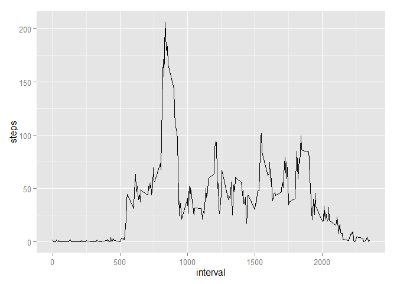

# Reproducible Research: Peer Assessment 1


```r
options(scipen=100000, digits=2)
```


## Loading and preprocessing the data

```r
activity <- read.csv("activity.csv")
activity$date <- as.Date(activity$date)
```


## What is mean total number of steps taken per day?
First, we sum by day.
Then we take mean and meadian of those daily values.  

```r
ag <- aggregate(steps ~ date, data=activity, FUN=sum)
ms <- mean(ag$steps)
mds <- median(ag$steps)
hist(ag$steps)
```

 

**The mean total number of steps taken per day is 10766.19; the median is 10765**


## What is the average daily activity pattern?
For the sake of simplicity, we have kept the time interval in its original scale.

```r
ag_5min <- aggregate(steps ~ interval, FUN=mean, data=activity)
library(ggplot2)
qplot(interval, steps, data=ag_5min, geom="line")
```

 

```r
mx <- which.max(as.numeric(ag_5min$steps, names=ag_5min$interval))
```

**On average, the most active 5 minute interval is interval number 104**


## Imputing missing values

```r
act_imp <- activity
nas <- is.na(act_imp$steps)
n_nas <- sum(nas)
act_imp$steps[nas] <- ag_5min[match(act_imp$interval[nas], ag_5min$interval),"steps"]
```

**There are 2304 NA values in the dataset**  
We use the mean steps across all days for the missing interval in question


```r
ag_imp <- aggregate(steps ~ date, data=act_imp, FUN=sum)
ms_imp <- mean(ag_imp$steps)
mds_imp <- median(ag_imp$steps)
hist(ag_imp$steps)
```

 

**After imputation, The mean total number of steps taken per day is 10766.19 (originally 10766.19); the median is 10766.19 (originally 10765)**  
We note that the mean remains the same as the original data, but the median drops slightly.


## Are there differences in activity patterns between weekdays and weekends?
First, two separate plots:

```r
act_imp$weekend <- weekdays(act_imp$date) %in% c("Saturday", "Sunday")
act_imp$weekend <- as.factor(act_imp$weekend)
levels(act_imp$weekend) <- c("Weekday", "Weekend")
qplot(interval, steps, data=act_imp, facets=weekend~., geom="line")
```

 
  
And overlayed on the same set of axes:

```r
g <- ggplot(act_imp, aes(interval, steps))
g + geom_line(aes(color=weekend), size=2, alpha=.5)
```

 

**There appears to be a noticeable difference between weekend and weekday activity.**
